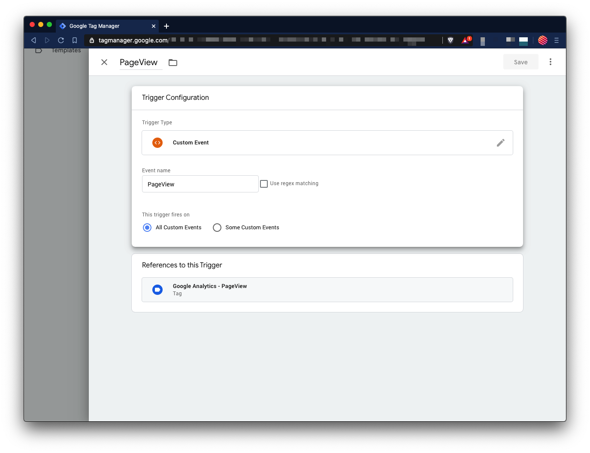
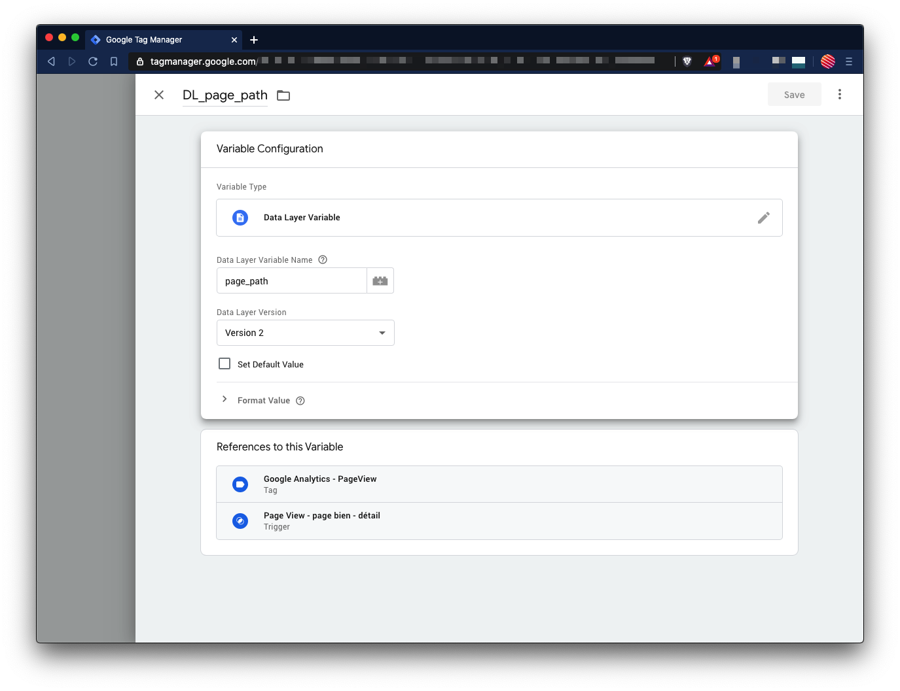
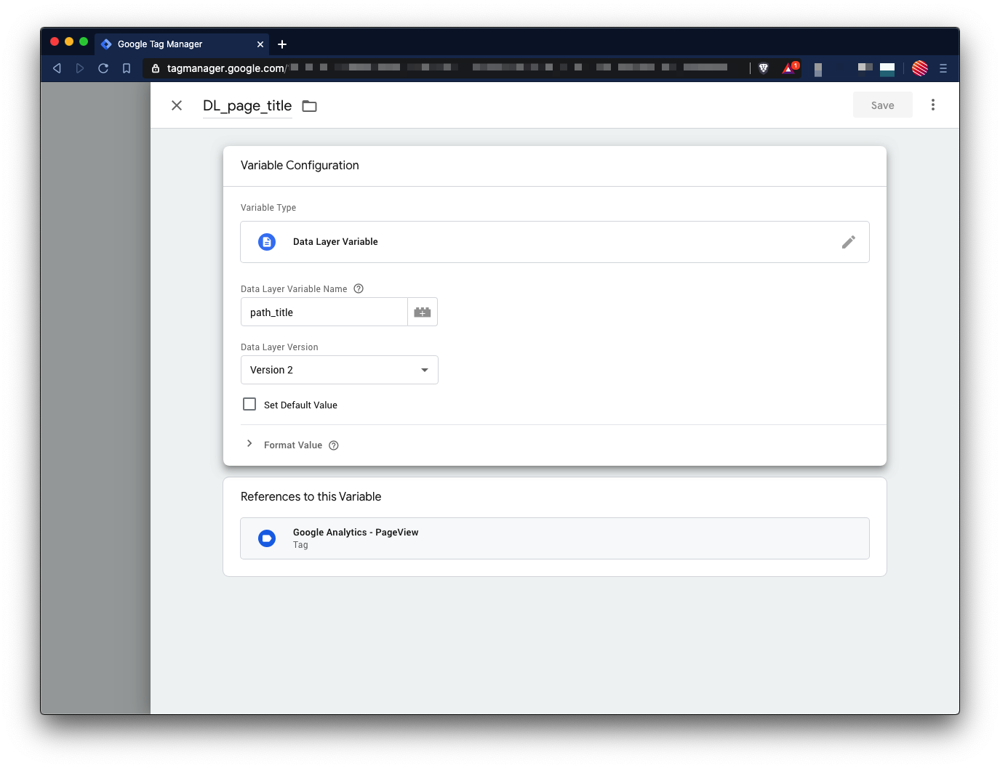
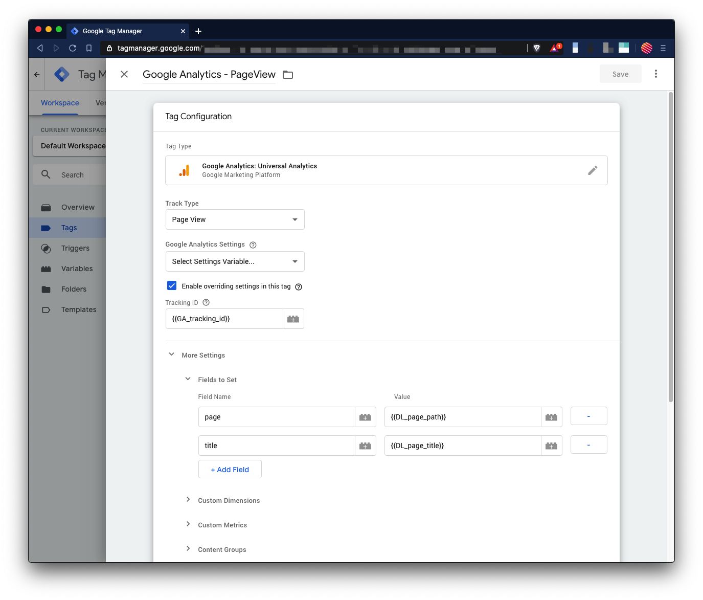
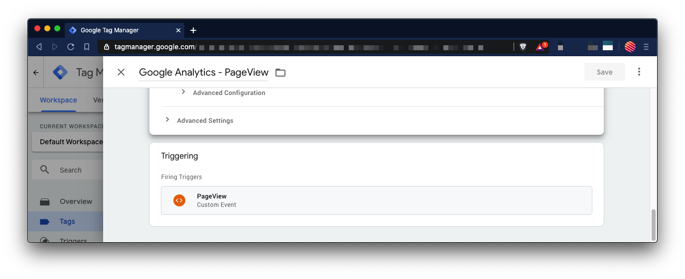

# 📈 Google Tag Manager

This is a simple, step by step, **tutorial to install and use Google Tag Manager inside your React/JavaScript/TypeScript project**.


## 1. Installation

Install [react-gtm-module](https://github.com/alinemorelli/react-gtm) on your project.

```bash
$ yarn install react-gtm-module
```

## 2. Create the service

Create a `google-tag-manager.js` service like so :

```tsx
import TagManager from 'react-gtm-module';

// Call this method on each new page
const init = options => {
  TagManager.initialize({
    gtmId: process.env.GOOGLE_TAG_MANAGER,
    ...options,
  });
};

// Add data to GTM's datalayer
const dl = dataLayer => {
  TagManager.dataLayer({ dataLayer });
};

// Track new event and attach custom data
const event = (name = 'event', data = {}) => {
  TagManager.dataLayer({
    dataLayer: { event: name, ...data },
  });
};

// Rest GTM states (clean residual data layers)
const reset = (dataLayerName = 'dataLayer') =>
  window?.google_tag_manager?.[process.env.GOOGLE_TAG_MANAGER]?.[
    dataLayerName
  ]?.reset();

export default {
  init,
  dl,
  event,
  reset,
};
```
**TypeScript example coming soon (feel free to update it 😉)*

## 3. Init and Reset

Import and use `init` and `reset` methods in a component present on each page of your app (f.ex. `SEO.tsx`, `App.tsx`, `Layout.tsx`, etc) and **listen for page change**.

For example, with NextJS:

```tsx
import { useRouter } from 'next/router';

import gtm from 'services/google-tag-manager';

const SEO = () => {
  const { asPath } = useRouter();

  useEffect(() => {
    gtm.reset(); // Remove previous previous page data layers
    gtm.init(); // Re-set GTM environment

    // Custom PageView event for “SPA” stack
    gtm.event('PageView', {
      page_path: router.asPath,
      page_title: metaTitle?.attributes?.content || 'Titre inconnu',
    });
  }, [asPath]);

  return (...);
};
```

## 4. Data Layer and Event

Now, you can use the `dl` and `event` methods to **track custom actions**. Remember:
- **Data Layer** is used to **add data** to the current context.
- **Event** is used to **send data** to GTM whenever you want (with data layer's data attached)

It's also a good practice to **define data layer on page change** and not only on component's mount.

For example, with NextJS:

```tsx
import { useRouter } from 'next/router';

import gtm from 'services/google-tag-manager';

const ArticlePage = () => {
  const { asPath } = useRouter();

  useEffect(() => {
    // Add data to this page's context
    gtm.dl({ author: article.author.name });
  }, [asPath]);

  return (
    <article>
      {/* ... */}
      <button
        onClick={() => {
          facebookShare(); // Do your business
          gtm.event('article.share', { mode: 'facebook' }) // Track event
        }}
      >
        Share on Facebook
      </button>
    </article>
  );
};
```

## 5. Configure Page Views on Tag Manager

GTM is still not an happy place for JavaScript applications and we need to add some configuration in order to **track properly page views on Google Analytics**.

### Trigger

**Create a `PageView` trigger** based on the `PageView` event. Nothing more.



### Variables

In order to **retrieve the data** of your custom `PageView` event (*from step 3*), you must set **two new variables**:

- `DL_page_path` : *Data Layer Variable* based on `page_path`
  


- `DL_page_title` : *Data Layer Variable* based on `page_title`
  

### Tag

Finally, to properly send your page views to Google Analytics, **create a new *Google Analytics Universal Analytics* tag** and re-set `page` and `title` fields with our new variables (see the following screenshots).



Bind your trigger and you’re done !



